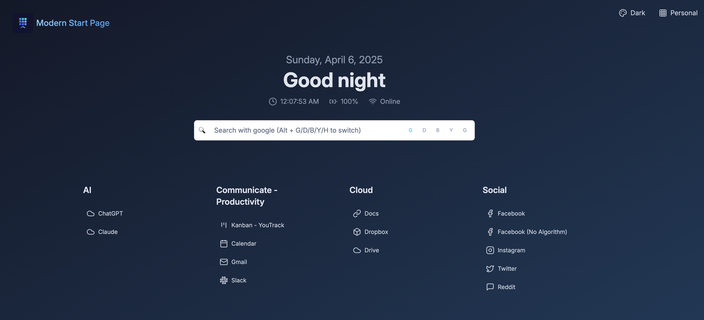

# Modern Start Page

A modern, customizable browser start page built with Astro and React. Features a clean UI, multiple search engines, theme switching, and persistent configuration. Perfect for self-hosted server dashboards and new tab pages.



> **Note:** This project was heavily influenced by [SUI](https://github.com/jeroenpardon/sui), a start page that served as my daily driver for many years. After 5-6 years since its last update, I decided to modernize the concept with current web technologies while maintaining its core functionality and simplicity.

## Features

- 🎨 Multiple pre-defined themes with easy customization
- 🔍 Support for multiple search engines
- 📱 Responsive design that works on all devices
- 📦 Simple JSON-based configuration
- 🐳 Easy Docker deployment
- 🔄 Persistent configuration with file-based storage
- 🎯 Clean, modern UI with Lucide icons
- ⚡ Fast and lightweight
- 🌤️ Widget support (Weather, Clock, and more to come)

## Getting Started

### Prerequisites

- Node.js (v18 or higher)
- npm or yarn
- OpenWeather API key (for weather widget)

### Installation

1. Clone the repository:
```bash
git clone https://github.com/ericblue/modern-start-page.git
cd modern-start-page
```

2. Install dependencies:
```bash
npm install
```

3. Create a `.env` file based on `.env.example` and add your OpenWeather API key:
```bash
cp .env.example .env
# Edit .env and add your OpenWeather API key
```

4. Start the development server:
```bash
npm run dev
```

5. Build for production:
```bash
npm run build
```

## Configuration

The application uses a simple JSON file storage system for configuration. Here's the default configuration structure:

```json
{
  "contexts": [
    {
      "id": "default",
      "name": "Default",
      "categories": [
        {
          "name": "Development",
          "displayMode": "icon",
          "links": [
            {
              "name": "GitHub",
              "url": "https://github.com",
              "icon": "github"
            },
            {
              "name": "GitLab",
              "url": "https://gitlab.com",
              "icon": "gitlab"
            }
          ]
        },
        {
          "name": "Social",
          "displayMode": "icon",
          "links": [
            {
              "name": "Twitter",
              "url": "https://twitter.com",
              "icon": "twitter"
            },
            {
              "name": "Reddit",
              "url": "https://reddit.com",
              "icon": "reddit"
            }
          ]
        }
      ]
    }
  ],
  "activeContext": "default",
  "theme": "dark",
  "gridColumns": 4,
  "displayMode": "icon",
  "showCategoryBorders": true,
  "widgets": {
    "weather": {
      "enabled": true,
      "useCelsius": false
    },
    "clock": {
      "enabled": true,
      "showSeconds": true
    }
  }
}
```

### Widgets

The start page includes several widgets that can be enabled/disabled and customized:

- **Weather Widget**: Shows current weather conditions based on your location
  - Requires an OpenWeather API key
  - Can toggle between Celsius and Fahrenheit
  - Automatically detects your location

- **Clock Widget**: Displays the current time
  - Can show/hide seconds
  - Updates in real-time

Widget settings can be configured through the settings modal, where you can:
- Enable/disable individual widgets
- Configure widget-specific settings
- Customize the appearance and behavior

### Customization Options

- Theme selection (Dark/Light)
- Layout customization (grid columns, display mode)
- Quick links management with icons
- Search engine preferences
- Multiple contexts for different use cases
- Category-based organization

## Docker Support

The application can be run in a Docker container:

```bash
# Build the image
docker build -t modern-start-page:latest .

# Run the container
docker run -p 4000:4000 modern-start-page:latest
```

## Contributing

Contributions are welcome! Please feel free to submit a Pull Request.

## License

This project is licensed under the MIT License - see the [LICENSE](LICENSE) file for details.

## Author

Created by Eric Blue (https://ericblue.com)
